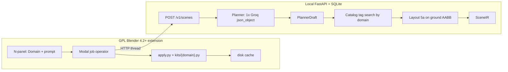

# AI Director: Production Engineering Spec

| Field | Value |
| --- | --- |
| Title | AI Director — Any-domain scene compiler for Blender |
| Author | AI Director (internal) |
| Date | 2026-09-25 |
| Status | Draft (rev 5) |
| Replaces | `planning.txt` and rev 4 interiors-only wedge |
| Audience | Founding engineers (2 people can execute Phase 0) |

This is a **product-engineering** plan. There is no monetization phase, no Stripe, no paid SKU, no license-key N-panel, no purchased asset packs, and no paid large-model default.

**Rev 5 product lock (user, 2026-09-25):** the artist **chooses the place**. Park, zoo, space, city, forest, interior, beach, or Auto-from-prompt. The compiler builds that place. Domain is a first-class input. Jobs are not refused because the prompt is a forest or a space station.

---

## Overview

The live addon (`C:\me\proj\ai_director_addon\__init__.py`) POSTs a user prompt to Groq `llama-3.3-70b-versatile` and `exec`s the returned `bpy` on the main thread. `planning.txt` proposed three LLM agents, LLM-authored XYZ, a fabricated Poly Haven file URL, and live Sketchfab/BlenderKit search. That cannot ship.

**What we build:** a **local FastAPI** planner that turns `(domain, prompt)` into a versioned **SceneIR** JSON document, plus a thin GPL Blender 4.2+ client that **deterministically applies** that IR. The LLM never writes Python and never owns world coordinates.

The artist picks a **domain** in the N-panel (or Auto). Every domain uses the same compiler:

1. A **shell kit** (ground / room / deck) built from bmesh parts.
2. **Objects** as a closed part vocabulary (`slab`, `beam`, `cover`, `mass`, `pole`, `board`, `seat`, `puddle`, `foliage`, `enclosure`, `module`) plus a category for catalog search.
3. Poly Haven CC0 assets when we have a tagged hit; a **named proxy** when we do not.
4. HDRI + light preset from the domain table.
5. Layout on the domain’s ground AABB (Phase 0: authored poses; Phase 1: greedy pack).

**Default LLM:** Groq `llama-3.3-70b-versatile` with `response_format: {type: json_object}`. `GROQ_API_KEY` stays in the **backend env**. The addon never stores a Groq key as a Scene property.

---

## CEO Verdict: Is this idea OK?

**Verdict: go — as a domain-chosen scene compiler.**

The product is: *tell us the place (or let Auto read the sentence), get an editable Blender scene of that place.* A park, a zoo, a city block, a forest clearing, a space deck, a beach, a living room — same pipeline, different shell + prop pack + HDRI.

What would make this a demo graveyard is a **single** `exec(bpy)` path that tries to invent unique meshes for every noun. We still compile JSON. We still use free CC0 APIs. We still snap and pack. We **open the domain menu**.

### Promise

From a **chosen domain + a sentence**, get a physically plausible, CC0-or-proxy, editable scene in Blender that an artist would start lighting from.

### What the artist chooses

N-panel **Domain** enum:

| Id | Shell | Typical props | HDRI mood |
| --- | --- | --- | --- |
| `auto` | Planner infers from the prompt | — | — |
| `interior` | `box_room` walls + floor + ceiling | furniture, lamps, plants | indoor / warm / studio |
| `park` | ground + path slabs | trees, benches, lamps, ponds | daytime park / overcast |
| `forest` | larger ground, noisier, denser foliage | trees, rocks, logs, undergrowth | forest / overcast |
| `city` | street + sidewalks + building masses | streetlamps, signs, vehicles-as-proxies | urban day / night |
| `zoo` | paths + enclosure covers/fences + habitat slabs | benches, signs, **animal_proxy** | zoo / park HDRI |
| `space` | station **deck** (no walls) + modules | modules, crates, antennae, planet sphere | stars / milky-way HDRI |
| `beach` | ground + water plane | rocks, umbrellas, boards | beach / sunset HDRI |
| `generic` | flat ground of `extent_m` | whatever the prompt names, as parts | matching HDRI or studio |

Unknown nouns (`lion`, `star destroyer`, `Eiffel tower`) become **named proxies** with the right scale class. The scene still generates. That is how zoo and space stay in the product on a free catalog.

### Locked engineering (unchanged)

- Kill `exec` of model Python.
- Groq open-weight default.
- Poly Haven CC0 + primitives. No Meshy/Rodin/T2-3D in v1.
- No monetization phase.
- Greedy AABB packer. Modal bpy apply. Stdlib client validator.

---

## Autopsy of the previous plan (`planning.txt`)

Quoted against `C:\me\proj\ai_director_addon\ai_director_backend\planning.txt` (180 lines).

**Keep from that file:** Groq + Poly Haven, JSON contract, threaded downloads, raycast snap, cinematic HDRI lighting, procedural shells for environments that are not a single mesh.

**Drop:** three LLM agents, LLM XYZ as the final pose, fake `https://api.polyhaven.com/files/vintage_chair.glb`, unofficial `parse.bot` BlenderKit scrape, LLM-written Geometry Nodes Python, Principled Volume as model code, `exec(bpy)`.

**Rev 4 error this rev fixes:** interiors-only wedge and an OOD regex that **refused** city/forest/spaceship. The user wants those domains. Refusal is only for empty prompt or unparsable JSON after repair.

| Bottleneck | Fix in this plan |
| --- | --- |
| `exec` of `bpy` (live addon) | SceneIR → local apply functions |
| Three sequential LLM agents | One Groq `json_object` call |
| Absolute XYZ from the model | PlannerDraft = domain + relations + parts; solver/fixtures fill `layout` |
| “Any mesh from any noun” | Domain kit + part vocabulary + PH hit or named proxy |
| Open APIs as infinite unique assets | PH CC0 index tagged by **domain**; miss → proxy |
| Raycast-only snap | Pack on ground AABB, then snap; `on` sockets in 5b |
| `bpy` thread safety | Modal job operator owns all bpy |
| Monetization Phase 4 | Struck |

---

## Background & Motivation

### Current state (this repo)

`ai_director_backend` is this spec + `planning.txt`. The parent addon is a 119-line Blender 4.2 N-panel:

| Fact | Location | Implication |
| --- | --- | --- |
| POST Groq `llama-3.3-70b-versatile` | `generate_with_groq` | Groq key on `scene.groq_api_key` leaks via `.blend` |
| System prompt: output only `bpy` | lines 15–20 | Model is the compiler |
| `exec(clean_code, {'bpy': bpy})` | line 65 | Arbitrary code, main thread |
| `self.report` in a free function | line 40 | `NameError` on API failure |
| HTTP inside `Operator.execute` | lines 49–58 | UI freeze |
| Manifest GPL-3.0-or-later, version 1.0.0, tagline “Text-to-Scene and Cinematography AI Pipeline” | `blender_manifest.toml` | Phase 0: version **0.1.0**, tagline **“Text-to-scene compiler (SceneIR)”**, network **“AI Director local/API planner”**. Drop `bl_info`. |

### Sibling idea we now use

`face_agents/scene_director.py` already treated **any place** as the same parts in meters: `slab|beam|cover|mass|pole|board|seat|puddle`, with a location enum that included park, forest, street, beach, interior. Keep JSON + meters + closed parts. Drop LLM XYZ and generated bpy strings. Add `foliage`, `enclosure`, `module` so zoo/forest/space have names.

---

## Product definition

### Who uses it

Blender artists who need a **startable set** from a sentence: previs, YouTube, archviz, student films, game greybox. They pick the world (park / city / space / …) and describe what is in it.

### Jobs-to-be-done

1. “Park at dusk, path, benches, trees, a pond.”
2. “City street, two building masses, streetlamps, a food-cart proxy.”
3. “Forest clearing, wet ground, logs, dense trees.”
4. “Zoo: two enclosures, a path, a lion proxy, a sign.”
5. “Space station deck, crates, antenna, Earth in the HDRI.”
6. “Living room, sofa facing the window.”
7. “I picked Domain=Auto; read the sentence.”

### Competitive set

Meshy/Rodin invent meshes. BlenderKit is manual search. LLM-writes-bpy addons are the current demo. We **orchestrate domain kits + CC0 + proxies** into an editable `.blend`.

### What we are not selling

No $29 Pro, no Stripe, no lifetime key. The product is a compiler + planner an engineer runs locally.

### Success metrics

- Domain accuracy: chosen or inferred domain matches the prompt’s place (≥ 90% on golden set).
- Scene always applies: 0 refused jobs for in-vocab domains.
- Server: objects inside ground AABB ≥ 95%; eligible 2D overlap < 8% (outdoor scatter is looser than interiors).
- Relation predicates ≥ 75% outdoor / ≥ 80% interior.
- Nightly contact after snap > 90% (deck/ground).
- Human 1–5 “would I start from this” mean ≥ 3.5 across **all shipped domains**, from alpha artists.
- TTFV **post-`ir_ready`**: shell + proxies < 8s.
- Catalog hit-rate **reported** per domain (space/zoo will be proxy-heavy; that is expected).

---

## Goals & Non-Goals

### Goals

- Domain is a user choice (plus Auto).
- Kill Groq-in-the-addon `exec`. SceneIR + local apply.
- One compiler for every domain: kit + parts + layout + HDRI.
- Phase 0: modal apply of bundled fixtures for **at least two domains** (`interior` and `park`). Other domain kits in Phase 0.5 as empty-shell + proxies.
- Phase 1: Groq PlannerDraft with `domain` field; PH ingest tagged by domain; greedy pack on that domain’s ground.
- Eval golden set **covers every shipped domain**.
- GPL client; local FastAPI + SQLite.

### Non-goals (v1)

- Monetization, Stripe, magic-link, SKUs.
- Paid models as default (GPT-4 / Claude / Gemini / Grok required).
- Purchased packs, Meshy/Rodin/T2-3D.
- Live Sketchfab/BlenderKit backbone.
- Unique photoreal animals, vehicles, or spacecraft (those are **named proxies**).
- Full city GIS, real zoo CAD, orbital mechanics.
- `volume` / fog cubes as LLM Python.
- CP-SAT. CLIP/pgvector.
- Refusing a job because the domain is outdoor or space.

---

## Phased product

### Phase 0 — Compiler that already understands domain (4–6 weeks)

**Ships:**

- SceneIR v0.1 with `domain` + `WorldSpec` + part vocabulary.
- Delete `generate_with_groq`, `exec`, `scene.groq_api_key`, `bl_info`. Manifest 0.1.0.
- N-panel: **Domain** enum + prompt.
- Modal job operator applies bundled fixtures. Kits/proxies via **bmesh/`bpy.data` only**.
- Kits implemented in Phase 0: `interior` (`box_room` solid walls) and `park` (ground + path).
- Two fixtures: 15-proxy living room, 12-proxy park. All `catalog_id`/`hdri` null.
- Stub FastAPI returns the fixture matching `domain` (or the prompt keyword).
- Single undo. Offline path on the main thread.

**Out:** Groq, live catalog, solver, remaining kits as full dressing (stubs allowed).

**Bars:** Apply either fixture without crash. Ctrl+Z once clears `aidir.*`. Domain dropdown switches which fixture loads offline. `predicates` 100% on each fixture’s core relations.

**Kill:** If domain is still hardcoded to `box_room` in apply, Phase 0 failed.

### Phase 0.5 — Remaining shells (parallel, after PR 2)

Kits: `forest`, `city`, `zoo`, `space`, `beach`, `generic`. Each is a shell (ground/deck/water) + 8–15 named proxies from a bundled fixture. No PH required.

### Phase 1 — Groq + PH index + greedy pack

1. Groq `json_object` PlannerDraft including **`domain`**. Honor the UI choice; Auto infers.
2. Ingest PH: HDRIs for every domain, plants/trees, furniture for interior, whatever models exist for outdoor.
3. Layout 5a on **that domain’s ground AABB** (walls only for `interior`).
4. glTF swap + re-snap when cache hits.
5. Eval: 15+ prompts, **≥ 2 per shipped domain**.

**Kill:** If Auto domain is wrong on > 30% of goldens, fix the prompt/enum before adding kits. If a domain kit crashes apply, unship that kit.

### Phase 2 — Revise + sockets + denser dressing

- `SceneIRPatch` (works on every domain).
- 5b `on` sockets; 5c camera keep-out.
- Scatter density controls for forest/park.
- More PH ingest (plants, HDRIs, remaining furniture).

---

## Proposed Design



Phase 0: skip P/CAT/SOLVE; API/offline returns the fixture for the chosen domain.

### Sequence (Phase 1)

Artist sets Domain (or Auto) → modal POST `{prompt, domain}` → Groq PlannerDraft → catalog stamp (domain-scoped) → pack on ground → `ir_ready` → apply **that** kit shell → proxies → GLB swaps.

---

## Scene IR v0 (implementable contract)

Two frozen schemas. **PlannerDraft** is what Groq may emit. **SceneIR** is what the client applies. The LLM never sees `layout`, URLs, `catalog_id`, or world lights.

### Versioning

- `schema_version` is `"0.1"` (major.minor).
- Client accepts `0.1.*`. Reject other majors. `additionalProperties: false` on typed objects.

### Domain and parts

```python
from typing import Literal, Optional
from pydantic import BaseModel, ConfigDict, Field

class Strict(BaseModel):
    model_config = ConfigDict(extra="forbid")

Domain = Literal[
    "auto", "interior", "park", "forest", "city", "zoo", "space", "beach", "generic"
]
# "auto" is UI-only. After planning, SceneIR.domain is never "auto".

Part = Literal[
    "slab", "beam", "cover", "mass", "pole", "board", "seat", "puddle",
    "foliage", "enclosure", "module", "proxy_box", "proxy_cylinder", "proxy_sphere",
]

# Categories are open-enough for every domain. Unknown strings are allowed
# on SceneObjectDraft.category as pattern ^[a-z][a-z0-9_]{0,31}$
# and always get a named proxy if catalog misses.
# Suggested (not exclusive) values:
# interior: sofa, armchair, dining_chair, stool, ottoman, coffee_table, dining_table,
#   desk, nightstand, side_table, bed, bookshelf, cabinet, dresser, lamp_floor,
#   plant, rug, art_frame, mirror
# outdoor: tree, bush, bench, path, rock, log, streetlamp, sign, fountain, pond,
#   building_mass, sidewalk, vehicle, fence
# zoo: enclosure, habitat, animal, visitor_bench, kiosk
# space: deck, crate, antenna, solar_panel, planet, module, tank
# beach: water, umbrella, towel, driftwood

RelationType = Literal[
    "on", "next_to", "facing", "against_wall",
    "in_front_of", "behind", "centered_on",
    "along", "scatter",
]
# along = follow a path slab (park/city/zoo)
# scatter = keep clearance from others, anywhere on ground (forest trees)

WallId = Literal["wall.north", "wall.south", "wall.east", "wall.west"]
# against_wall is valid only when domain == interior; otherwise dropped with warning.

class Relation(Strict):
    type: RelationType
    target: str  # object id | "floor" | "ground" | WallId | "path"
    clearance_m: float = 0.15

class Opening(Strict):
    type: Literal["door", "window"]
    wall: WallId
    offset_m: float
    width_m: float
    sill_m: float = 0.0
    height_m: float

class WorldSpec(Strict):
    """Interior uses room fields. Outdoor/space uses extent + ground."""
    extent_x_m: float = Field(ge=4.0, le=120.0)
    extent_y_m: float = Field(ge=4.0, le=120.0)
    height_m: float = Field(ge=2.0, le=40.0)  # room height or sky/deck clearance
    wall_thickness_m: float = 0.15            # interior only
    openings: list[Opening] = []              # interior only
    ground: Literal[
        "floor", "grass", "dirt", "pavement", "sand", "water_edge", "metal_deck", "void"
    ] = "floor"
    terrain_amp_m: float = Field(ge=0.0, le=2.0, default=0.0)  # forest/park bump
```

Interior `box_room` mapping: `extent_x_m` = inner width, `extent_y_m` = inner depth, origin still inner SW, +X east, +Y north, +Z up.

Outdoor/space: origin at ground SW, same axes. No walls. `against_wall` relations are stripped.

```python
class SceneObjectDraft(Strict):
    id: str = Field(pattern=r"^[a-z][a-z0-9_]{0,31}$")
    category: str = Field(pattern=r"^[a-z][a-z0-9_]{0,31}$")
    part: Part = "mass"
    relations: list[Relation] = []
    style_tags: list[str] = []

class CameraDraft(Strict):
    preset: Literal["establishing_35", "medium_50", "wide_24"] = "establishing_35"
    look_at_id: Optional[str] = None

class CameraPose(Strict):
    location_m: tuple[float, float, float]
    look_at_m: tuple[float, float, float]
    focal_mm: float = 35.0

class PlannerDraft(Strict):
    schema_version: Literal["0.1"] = "0.1"
    domain: Literal["interior", "park", "forest", "city", "zoo", "space", "beach", "generic"]
    world: WorldSpec
    objects: list[SceneObjectDraft]
    camera: CameraDraft
    light_preset: Literal[
        "high_key", "soft_day", "warm_interior", "noir", "overcast",
        "sunset", "night_urban", "stars",
    ]
    notes: str = ""

class Pose(Strict):
    location_m: tuple[float, float, float]
    rotation_euler_rad: tuple[float, float, float]
    scale: tuple[float, float, float] = (1.0, 1.0, 1.0)
    support: str = "ground"
    snap_z_pending: bool = True
    infeasibility: Optional[str] = None

class LightSpec(Strict):
    role: Literal["key", "fill", "rim", "sun"]
    type: Literal["AREA", "SUN"]
    energy: float
    color_temp_k: int
    offset_from_camera_m: tuple[float, float, float]  # camera-local

class HdriRef(Strict):
    catalog_id: str
    intensity: float = 1.0
    rotation_z: float = 0.0

class Fallback(Strict):
    object_id: str
    reason: Literal["no_catalog_hit", "scale_clamped", "relation_dropped", "out_of_ground", "wall_on_outdoor"]
    primitive: Part

class Attribution(Strict):
    catalog_id: str
    license: Literal["CC0"]
    text: str

class SceneObject(SceneObjectDraft):
    catalog_id: Optional[str] = None
    license: Optional[Literal["CC0"]] = None
    real_size_m: tuple[float, float, float]

class SceneIR(Strict):
    schema_version: Literal["0.1"] = "0.1"
    job_id: str
    prompt: str
    domain: Literal["interior", "park", "forest", "city", "zoo", "space", "beach", "generic"]
    world: WorldSpec
    objects: list[SceneObject]
    layout: dict[str, Pose]
    camera: CameraDraft
    camera_pose: CameraPose
    lights: list[LightSpec]
    hdri: Optional[HdriRef] = None
    light_preset: str
    fallbacks: list[Fallback] = []
    warnings: list[str] = []
    attribution: list[Attribution] = []
    status: Literal[
        "queued", "planning", "solving", "ready", "applying",
        "complete", "failed"
    ]
```

`set(layout) == {o.id for o in objects}`. `volume` stays deleted. No `status: refused` for domain.

### Default extents (when no catalog)

| category / part | x, y, z m |
| --- | --- |
| sofa | 2.10, 0.90, 0.85 |
| tree / foliage | 2.00, 2.00, 6.00 |
| bench / seat | 1.60, 0.50, 0.90 |
| building_mass | 8.00, 8.00, 12.00 |
| streetlamp / pole | 0.20, 0.20, 4.50 |
| enclosure / cover | 6.00, 8.00, 3.50 |
| animal | 2.20, 0.80, 1.20 |
| module (space) | 4.00, 4.00, 3.00 |
| crate | 1.20, 1.20, 1.20 |
| antenna | 0.30, 0.30, 6.00 |
| planet (sphere) | 20, 20, 20 (placed far on +Y) |
| rock | 1.50, 1.20, 0.80 |
| pond / puddle | 6.00, 4.00, 0.05 |
| vehicle | 4.20, 1.80, 1.50 |
| path slab | 12.00, 2.40, 0.08 |

Unknown category: `mass` 1.0×1.0×1.0 named proxy.

### Phase 0 fixtures

**`fixtures/living_room_v0.json`** — domain `interior`, 15 primitives, same core sofa/table/plant/rug math as rev 4 (inner 5.5×4.2, sofa y=0.41, table y=1.675, plant x=3.96, camera inside room). `catalog_id`/`hdri` null.

**`fixtures/park_v0.json`** — domain `park`, world 40×30 m grass, path slab along +Y, 4 trees (`foliage`, `scatter`), 2 benches (`seat`, `along` path), 1 pond (`puddle`, `centered_on` ground offset), 2 lamps (`pole`). Camera at (4, 4, 1.6) looking at path. 12 objects. Predicates: benches within 0.5 m of path AABB; trees inside ground; pond inside ground.

Phase 0.5 adds `fixtures/forest_v0.json`, `city_v0.json`, `zoo_v0.json`, `space_v0.json`, `beach_v0.json` with the same rules (proxies only).

---

## Coordinate convention

| Axis | Meaning |
| --- | --- |
| Origin | Southwest corner of the **usable ground** (inner floor for interior) |
| +X | East |
| +Y | North (depth / street direction) |
| +Z | Up |
| Interior walls | same as rev 4 (`wall.south` at y=0, etc.) |
| Outdoor / space | no walls; ground rectangle `[(0,0),(X,0),(X,Y),(0,Y)]` |
| Space deck | metal slab 0.2 m thick, top at z=0; snap onto deck; HDRI does the “void” |

Object `location_m` = footprint center on the support plane. Yaw 0 = local +Y = world +Y.

**Interior walls:** segment gaps, not booleans (unchanged).

**Park path:** a `slab` object with id `path_1`; `along` target `path_1` places seats on the long edges.

**Forest terrain:** optional vertex noise `terrain_amp_m` on the ground mesh (≤ 0.4 m in v0). Snap uses raycast after noise.

**City:** one pavement `slab` + two `building_mass` boxes offset to ±X of the street.

**Zoo:** `enclosure` = `cover` (roof) + four `beam` posts; `animal` sits `on` habitat slab.

**Space:** `module` masses sit `on` deck; `planet` is a sphere at (extent_x/2, extent_y + 40, 8) — outside the pack region so it does not collide.

**Beach:** ground `sand` + a water plane at y > 0.6*extent_y, z = −0.05.

---

## Domain kits (`kits/`)

Every kit: **bmesh / `bpy.data` only**. Signature:

```python
def build_shell(world: dict, collection, job_id: str) -> None:
    """Ground / walls / water / deck. Tag objects aidir.role = 'shell'."""
```

| File | Builds |
| --- | --- |
| `kits/interior.py` | `box_room` floor, 4 walls (solid in PR 2, segments in 2b), ceiling |
| `kits/park.py` | grass ground, optional path leftover if IR has no path object |
| `kits/forest.py` | dirt/grass ground, slight noise |
| `kits/city.py` | pavement ground |
| `kits/zoo.py` | dirt/grass ground |
| `kits/space.py` | metal deck slab |
| `kits/beach.py` | sand ground + water plane |
| `kits/generic.py` | flat ground from `world.ground` material color |

Apply dispatch: `KITS[ir["domain"]](ir["world"], col, job_id)` then spawn each object by `part`.

### Part → mesh

| part | mesh |
| --- | --- |
| slab | box, origin top of thin height |
| beam | box, long axis +Y |
| cover | thin roof box + 4 poles |
| mass | box |
| pole | thin box / cylinder-approx box |
| board | thin box |
| seat | seat + back (two boxes) |
| puddle | very thin box, dark |
| foliage | cone-on-box (tree proxy) or cylinder (bush) |
| enclosure | cover + fence beams |
| module | beveled box (still a cube in v0) |
| proxy_sphere | icosphere via `bmesh.ops.create_icosphere` |

---

## Layout compiler

**Phase 0:** fixtures contain complete `layout`.

**Phase 1:** greedy AABB on `Feasible(0,0, extent_x, extent_y)`. Same stdlib packer as rev 4.

Interior-only: `against_wall`, openings as keep-outs.

All domains: `next_to`, `in_front_of`, `behind`, `centered_on`, `facing`.

Outdoor extras:

- `along` path: slots on long edges of the path AABB, inset `clearance_m`.
- `scatter`: `grid_scan` over full ground, skip occupied + 1.5× clearance (forest trees).

`against_wall` on a non-interior IR → drop + `wall_on_outdoor`.

**Library:** Python stdlib only. Stay greedy. No CP-SAT PR.

**Stub:** `stub_pack_grid(objects, world)` 3-column grid from SW, always fills every id. PR 6 uses 5a or stub.

**Camera:** inside the ground AABB. Interior: NW corner of the room. Outdoor: SW at 1.6 m looking toward centroid. Space: (2, −4, 2) relative to deck looking at centroid — if that is outside the deck, clamp onto the deck’s south edge at z=1.6. Never through a wall.

**Lights:** server table from `light_preset` + domain. `stars` → SUN dim + HDRI. `night_urban` → high-contrast AREA. Camera-local offsets.

Phase 0: `hdri` null. Phase 1: domain HDRI from PH; cache miss → no-op World.

---

## Asset system (free APIs, tagged by domain)

Poly Haven remains the backbone. Live counts (2026-09-25): **521** models, **85 furniture**, **57 plants**, hundreds of HDRIs. That is enough to **dress** interiors and parks; zoo animals and spaceships stay proxies.

### What we ingest

| Domain | PH we actually pull | Always-proxy |
| --- | --- | --- |
| interior | furniture seed (30 ids from rev 4, including `WoodenTable_02` as `side_table`) | rugs, most lamps |
| park / forest | plants, trees if they exist, rocks | dense unique species |
| city | whatever outdoor props exist | vehicles, storefronts |
| zoo | plants, benches | **all animals** |
| space | HDRIs (night, astro), metal materials | ships, astronauts, planets (sphere primitive) |
| beach | rocks, plants | umbrellas if missing |
| all | HDRIs mapped to presets | — |

Search: SQL `LIKE` on `category`, `tags`, **`domains`** (a JSON list on the row). Interior query does not return a pine tree.

### Ingest runbook (`scripts/ingest_polyhaven.py`)

Every PH HTTP call: `User-Agent: AIDirector/0.1 (+local ingest; https://polyhaven.com/our-api)`.

1. `GET /assets?t=hdris` and `GET /assets?t=models` (filter categories furniture, plants, nature, …).
2. Allow-list + domain tags in a YAML `ingest/allowlist.yaml`.
3. `GET /files/{id}` — nested format keys, never `.../files/{id}.glb`.
4. Download, sha256, headless Blender origin-to-ground, mm→m, aspect check.
5. Caps: 40 MiB, prefer < 80k tris, hard fail > 200k.
6. SQLite row with `domains: ["park","forest"]` etc.

N-panel + `AI_DIRECTOR_ATTRIBUTION`: **Powered by Poly Haven**.

**Miss:** named proxy sized from the default table; `needs_artist_asset`. Zoo without a lion GLB is still a zoo.

**Cache:** `Path(bpy.utils.user_resource("DATAFILES")) / "ai_director" / "cache" / sha256`.

Uniform GLB scale only; aspect error > 10% keeps proxy.

---

## Client (Blender 4.2+ extension)

Stdlib only in Phase 0. Same modal / `queue.Queue` / bmesh / glTF `undo=False` / wipe-on-exception rules as rev 4.

### Files

```
ai_director_addon/
  __init__.py
  blender_manifest.toml
  ir.py
  ir_schema.json
  job_modal.py
  apply.py
  catalog_cache.py
  kits/interior.py
  kits/park.py
  kits/forest.py
  kits/city.py
  kits/zoo.py
  kits/space.py
  kits/beach.py
  kits/generic.py
  fixtures/living_room_v0.json
  fixtures/park_v0.json
  ui/panel.py          # Domain enum + prompt
  prefs.py
```

**AddonPreferences:** `api_base_url`, `use_bundled_fixture`. Scene: `ai_director_domain` (enum, non-secret), `ai_prompt`, `ai_director_job_id`. **No Groq key on Scene.**

Offline: load `fixtures/{domain}_v0.json`; if missing, `generic` ground + empty objects still apply the shell.

### `ir.py`

Same stdlib JSON Schema subset as rev 4 (`type`, `required`, `properties`, `additionalProperties`, `enum`, `const`, `minimum`/`maximum`, `minItems`/`maxItems`, `pattern`, local `$ref`). Plus `set(layout)==object ids`.

### Modal operator

Unchanged shape: `REGISTER`+`UNDO`, `queue.Queue`, offline fixture on main thread, HTTP worker in PR 4, ESC/exception **wipe job collection** then `CANCELLED`. Kits/proxies: bmesh only. glTF: `bpy.ops.import_scene.gltf('EXEC_DEFAULT', False, filepath=...)` under `temp_override`. Post-swap **re-snap**. Cache miss **never** calls glTF.

Undo test: apply 15-proxy interior **and** 12-proxy park; each Ctrl+Z once clears `aidir.*`.

---

## Backend (`ai_director_backend`)

```
ai_director_backend/
  app/main.py
  app/api/v1/scenes.py
  app/ir/schema.py
  app/planner/groq_planner.py
  app/planner/prompt.py
  app/planner/domain.py        # UI domain wins; Auto infers
  app/catalog/sqlite.py
  app/layout/pack_5a.py
  app/layout/stub_pack.py
  app/jobs/store.py
  scripts/ingest_polyhaven.py
  fixtures/living_room_v0.json
  fixtures/park_v0.json
  ingest/allowlist.yaml
  eval/golden/
```

**Env:** `GROQ_API_KEY`, `GROQ_MODEL=llama-3.3-70b-versatile`, `AIDIR_DATA=./data`, `HOST=127.0.0.1`, `PORT=8000`.

### Domain resolution

```python
def resolve_domain(ui_domain: str, prompt: str) -> str:
    if ui_domain and ui_domain != "auto":
        return ui_domain  # user choice always wins
    return infer_domain(prompt)  # keyword table, then Groq field as tie-break
```

`infer_domain` keyword table (first match wins): space/orbit/station/planet/nasa → `space`; zoo/safari/enclosure/habitat → `zoo`; forest/woods/jungle → `forest`; park/playground/garden → `park`; city/street/downtown/alley → `city`; beach/shore/ocean → `beach`; living room/bedroom/office/kitchen/interior → `interior`; else `generic`.

**No OOD refuse** for those words.

### Planner

Default: Groq `llama-3.3-70b-versatile` + `json_object` + schema-in-prompt + one Pydantic repair. Zero tools. Server stamps catalog **filtered by domain**. Layout from 5a or `stub_pack_grid`.

If UI domain is set, the system prompt says `domain` **must** equal that value.

Max 20 objects. Min 3 or `failed` (`too_few_objects`). Unknown category → keep object as named proxy.

### System prompt (ship this)

```
You are a film/archviz set dresser. The user chose a DOMAIN. Build that place.
Reply with ONE JSON object (no markdown):
{
  "schema_version": "0.1",
  "domain": "interior"|"park"|"forest"|"city"|"zoo"|"space"|"beach"|"generic",
  "world": {"extent_x_m": number, "extent_y_m": number, "height_m": number,
            "wall_thickness_m": 0.15, "openings": [...],
            "ground": "floor"|"grass"|"dirt"|"pavement"|"sand"|"water_edge"|"metal_deck"|"void",
            "terrain_amp_m": number},
  "objects": [{"id":"snake_case","category":"snake_case","part":"slab"|"beam"|"cover"|"mass"|"pole"|"board"|"seat"|"puddle"|"foliage"|"enclosure"|"module"|"proxy_box"|"proxy_cylinder"|"proxy_sphere",
               "relations":[{"type":"on"|"next_to"|"facing"|"against_wall"|"in_front_of"|"behind"|"centered_on"|"along"|"scatter",
                             "target":"<id>|floor|ground|path|wall.north|wall.south|wall.east|wall.west","clearance_m":number}],
               "style_tags":[]}],
  "camera": {"preset":"establishing_35"|"medium_50"|"wide_24","look_at_id":"<id>"},
  "light_preset": "high_key"|"soft_day"|"warm_interior"|"noir"|"overcast"|"sunset"|"night_urban"|"stars",
  "notes": "short"
}
Rules:
- domain MUST match the provided DOMAIN.
- 4 to 16 objects. Unique ids. Relation targets must exist.
- against_wall only for interior. Outdoor: use along, scatter, next_to, centered_on.
- Animals, vehicles, spacecraft: category animal|vehicle|module, part proxy_box or enclosure. Do not claim a unique mesh.
- Never emit x,y,z, Python, URLs, catalog ids, or lights.
- Interior: include a floor-using furniture set and openings if mentioned.
- Park: path slab + trees + seats.
- Forest: many foliage scatter + rocks.
- City: street slab + at least two building_mass.
- Zoo: at least one enclosure + path + animal proxy.
- Space: deck-scale world, modules/crates, light_preset stars.
- Beach: sand ground, water implied by kit; rocks/boards.
```

### Few-shots (minimum)

1. Interior living room (existing sofa/window example).
2. Park dusk, path, benches, trees.
3. Space deck, crates, antenna, stars.

---

## API

| Method | Path | Contract |
| --- | --- | --- |
| `GET` | `/healthz` | `{ok: true, schema: "0.1"}` |
| `POST` | `/v1/scenes` | Header `Idempotency-Key`. Body `{prompt, domain}`. Domain default `auto`. **202** + `Location`. |
| `GET` | `/v1/scenes/{id}` | SceneIR |
| `GET` | `/v1/scenes/{id}/events?since=0` | SSE |
| `GET` | `/v1/catalog/search?q=&category=&domain=` | `{items, next}` |
| `POST` | `/v1/scenes/{id}/revise` | Phase 2 `SceneIRPatch` |

429 token bucket. 422 malformed body. `job_id` = `uuid.uuid4().hex`. Bind `127.0.0.1`.

---

## Data model

SQLite: `jobs`, `catalog_assets` (+ `domains` text). Client props: `aidir.object_id`, `aidir.domain`, `aidir.part`, `aidir.job_id`. Cache under `bpy.utils.user_resource("DATAFILES")`.

---

## Latency

Same as rev 4: TTFV **< 8s after `ir_ready`**. Groq measured, not contracted. GLB hitch accepted. Forest with 16 foliage proxies must still TTFV < 8s (proxies are cheap).

---

## Eval harness

Golden set **≥ 2 prompts per shipped domain** (Phase 0: interior + park = 4+; Phase 0.5/1: all eight). Example:

| id | domain | prompt must_include |
| --- | --- | --- |
| i1 | interior | sofa, window |
| i2 | interior | desk, chair |
| p1 | park | path, bench, tree |
| p2 | park | pond |
| f1 | forest | tree, rock |
| c1 | city | building_mass, streetlamp |
| z1 | zoo | enclosure, animal |
| s1 | space | module, crate, stars |
| b1 | beach | rock, sand |

Exemption table: rug∩floor, art∩wall, `on` child∩support, foliage∩foliage IoU < 0.2 (canopy overlap allowed), enclosure∩animal (animal inside).

CI: inside-ground, overlap, relations, domain field == expected. Nightly: contact after snap. Catalog hit-rate **per domain**, report-only.

---

## Revise (Phase 2)

`SceneIRPatch`: note + optional objects/relations + `light_preset` + **optional domain** (changing domain rebuilds the shell). Reuse `job_id` seed. Strip `layout` from LLM context.

---

## Alternatives considered

| Option | Decision |
| --- | --- |
| Interiors-only v1 | **Rejected by user.** Domain is a choice. |
| `exec(bpy)` per domain | **Reject.** Same IR compiler. |
| One kit that morphs via GN | **Reject for v0.** Separate Python kits, same apply loop. |
| Unique mesh per noun | **Reject in v1.** Named proxies + PH hits. |
| Refuse outdoor/space (rev 4 OOD) | **Reject.** |
| Three LLM agents | **Reject.** |
| Live Sketchfab backbone | **Reject.** |
| Paid models / bought packs / Stripe | **Reject.** |
| CP-SAT | **Reject as scheduled.** Stay greedy. |
| T2-3D | **Off for v1.** |

---

## Security & privacy

No `exec`. PlannerDraft `extra=forbid`. Groq key in backend env. LLM cannot set download URLs. GLB caps. Bind 127.0.0.1. Local prompt storage. 429 bucket.

---

## Legal / GPL

Addon GPL-3.0-or-later, version 0.1.0. PH CC0 + **Powered by Poly Haven**. Unique User-Agent. No Sketchfab scrape.

---

## Team / hosting

2 people. `uvicorn` on 127.0.0.1:8000. SQLite in `./data`. `AIDIR_PLANNER=fixture|groq`. Weekly PH ingest tagged by domain.

---

## Rollout

1. Phase 0: interior + park fixtures apply.
2. Phase 0.5: remaining shells.
3. Phase 1: Groq + PH + packer + goldens for every domain.
4. Eval before calling it production-useful.
5. Rollback: `AIDIR_PLANNER=fixture`.

---

## Key Decisions

1. **Go on any-domain-from-choice.** Park, zoo, space, city, forest, interior, beach, generic. UI Domain enum + Auto.
2. **One SceneIR compiler** for every domain (kit + parts + layout + HDRI).
3. **Kill `exec` of model Python.**
4. **No monetization phase.**
5. **Groq `llama-3.3-70b-versatile` + `json_object` + one repair.**
6. **Free CC0 APIs.** PH tagged by domain. Miss = named proxy. T2-3D off. Zoo animals and spacecraft are proxies on purpose.
7. **Phase 0 ships interior + park apply.** Other shells in 0.5. User choice works in the UI from PR 2.
8. **Greedy AABB on that domain’s ground.** `along` / `scatter` added. Stay greedy.
9. **Modal bpy pump**, bmesh kits, stdlib `ir.py`.
10. **Groq key in backend env.**
11. **TTFV post-`ir_ready`.**
12. **Eval across every shipped domain.**
13. **Revise is Phase 2.**
14. **Local FastAPI + SQLite.**
15. **User domain always wins over Auto inference.**

---

## Open Questions

Previous forks remain **RESOLVED**: stay greedy; keep llama-3.3-70b-versatile; T2-3D off; no Stripe.

**Rev 5 lock:** interiors-only is **void**. Domain menu is the product.

No new blocking questions. Kit polish order after park: forest → city → space → zoo → beach (shells are cheap; dressing quality follows PH HDRI + plants).

---

## References

- Live demo: `C:\me\proj\ai_director_addon\__init__.py`
- Prior plan: `planning.txt`
- Sibling parts idea: `face_agents/scene_director.py`
- Poly Haven API: `/assets`, `/files/{id}`, `/categories/models`
- Groq: `llama-3.3-70b-versatile` `json_object`

---

## PR Plan

No Stripe PR. Domain is in PR 1.

### PR 1 — SceneIR + PlannerDraft + two fixtures

- **Title:** `ir: SceneIR v0.1 with domain + interior and park fixtures`
- **Files:** `app/ir/schema.py`, `ir_schema.json`, `fixtures/living_room_v0.json`, `fixtures/park_v0.json`, `tests/ir/`
- **Depends on:** none
- **Changes:** `domain` + `WorldSpec` + `part`. Interior fixture predicates 100%. Park fixture: path/benches/trees inside ground. Extra-field reject tests.

### PR 2 — Kill exec + modal + Domain UI + interior and park shells

- **Title:** `addon: Domain picker; modal apply of interior and park fixtures`
- **Files:** `__init__.py`, `prefs.py`, `job_modal.py`, `apply.py`, `ir.py`, `kits/interior.py`, `kits/park.py`, `ui/panel.py`, `blender_manifest.toml`
- **Depends on:** PR 1
- **Changes:** Delete Groq-from-addon. Domain enum. Offline fixture chosen by domain. Bmesh only. Undo tests for both fixtures. No glTF.

### PR 2b — Interior wall segments

- **Depends on:** PR 2
- **Changes:** Door/window gaps, not booleans.

### PR 2c — Remaining shells

- **Title:** `addon: forest, city, zoo, space, beach, generic kits + fixtures`
- **Depends on:** PR 2
- **Changes:** Each kit is a shell + bundled proxy fixture. Space deck, beach water, city pavement, zoo ground, forest noise.

### PR 3 — Stub FastAPI

- Body `{prompt, domain}` → fixture for that domain (Auto uses `infer_domain`).
- **Depends on:** PR 1

### PR 4 — Client HTTP worker + progress

- **Depends on:** PR 2, PR 3

### PR 5a — Greedy pack on ground AABB

- Interior walls + outdoor `along`/`scatter`.
- Fixtures per domain (at least interior, park, space deck).
- **Depends on:** PR 1

### PR 6 — Groq PlannerDraft with mandatory domain

- UI domain wins. Auto infers. System prompt + 3 few-shots.
- `stub_pack_grid` if 5a missing.
- **Depends on:** PR 3 and (5a or stub)

### PR 7 — PH ingest tagged by domain + glTF swap

- Allowlist YAML with `domains: [...]`. HDRIs for all domains. Furniture 30-seed. Plants for park/forest.
- User-Agent + Powered by Poly Haven. Uniform scale. Miss keeps proxy.
- **Depends on:** PR 4, PR 6

### PR 8 — Eval goldens for every shipped domain

- **Depends on:** PR 5a; nightly needs PR 7

### PR 9 — Layout 5b `on` sockets

### PR 10 — Camera keep-out 5c

### PR 11 — Revise SceneIRPatch (domain-aware)

---

*End of spec. Implementation starts at PR 1. The artist picks the place. The compiler builds that place.*
